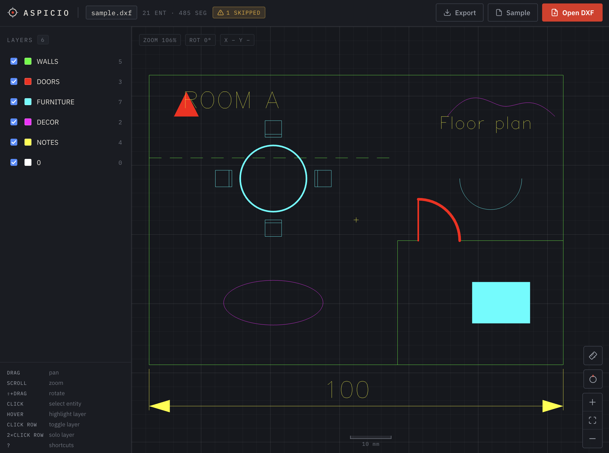
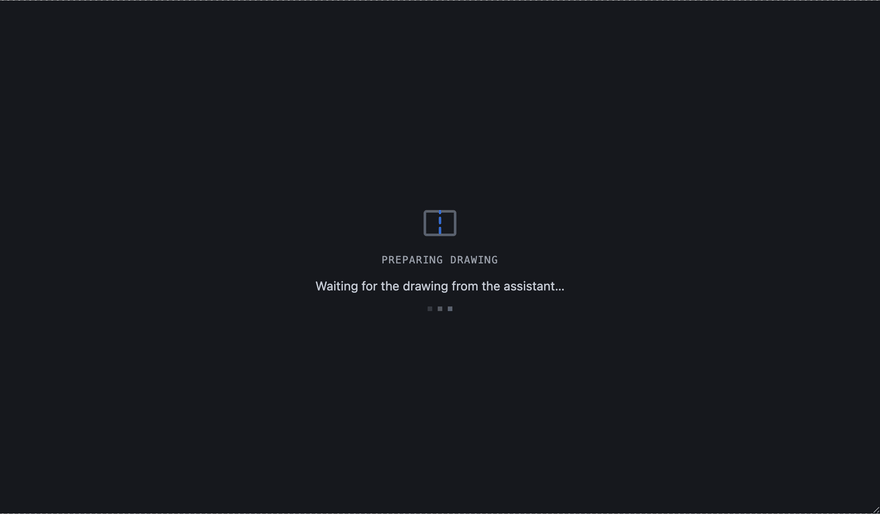
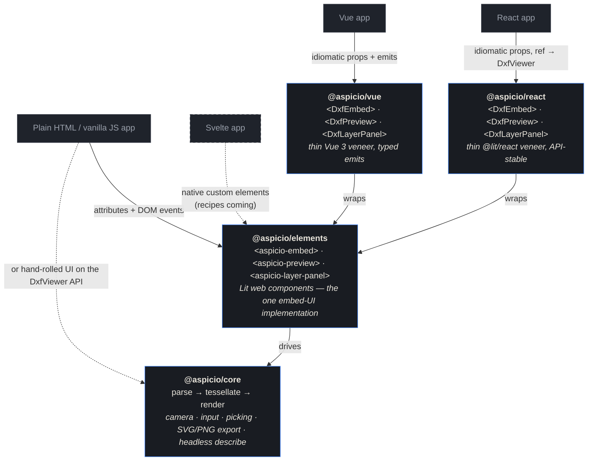

<div align="center">
  
  <h1>Aspicio</h1>
  <p><strong>DXF understanding for people, applications, and AI agents.</strong></p>
  <p><em>Aspicio</em> (Latin: "I look at")</p>
  <p>
    <a href="https://github.com/frontsail-ai/aspicio/actions/workflows/ci.yml"></a>
    <a href="https://www.npmjs.com/package/@aspicio/core"></a>
    <a href="https://www.npmjs.com/package/@aspicio/elements"></a>
    <a href="https://www.npmjs.com/package/@aspicio/react"></a>
    <a href="https://www.npmjs.com/package/@aspicio/vue"></a>
    <a href="https://www.npmjs.com/package/@aspicio/mcp"></a>
    <a href="LICENSE"></a>
  </p>
  <p><a href="https://aspicio.dmitri-66a.workers.dev"><strong>▶ Live demo</strong></a></p>
</div>

Aspicio is an open-source (MIT), TypeScript-first DXF engine: one
framework-free `parse → tessellate` pipeline that runs in the browser, in
Node, and in Cloudflare Workers. A person gets an interactive WebGL viewer
of a CAD drawing; an AI agent gets structured JSON facts and a rendered
PNG of the same file. Every surface — the browser viewer, the web
components and their React and Vue bindings, the headless renderer, the
HTTP API, and the MCP server — is a thin adapter over the same engine,
so a drawing is equally readable everywhere.

```
DXF bytes ──parse──▶ DxfDocument ──tessellate──▶ Tessellation ──┬─▶ WebGL renderer (viewer)
              (normalized model)      (batched geometry)        ├─▶ SVG string (export / API / MCP)
                                                                └─▶ DrawingSummary (describe)
```

How it's built: [docs/architecture.md](docs/architecture.md) · behavior
specs: [docs/product-specs/](docs/product-specs/README.md)



## Embed it

One embed, every flavor — and every path below renders the same web
components, so the result is pixel-identical no matter which you pick.

### Web components — plain HTML, Svelte, any framework

One tag gives you the layer panel plus an interactive preview; no
bindings needed:

```html
<script type="module">
  import "@aspicio/elements";
</script>

<aspicio-embed src-url="/drawing.dxf" style="height: 480px"></aspicio-embed>
```

### React

The same embed with idiomatic props and a `ref` exposing the full
viewer, via [`@aspicio/react`](packages/react):

```tsx
import { DxfEmbed } from "@aspicio/react";

<DxfEmbed src={file} style={{ height: 480 }} />;
```

### Vue

Typed props and emits with unwrapped payloads, via
[`@aspicio/vue`](packages/vue):

```vue
<script setup>
import { DxfEmbed } from "@aspicio/vue";
</script>

<template>
  <DxfEmbed src-url="/drawing.dxf" style="height: 480px" />
</template>
```

### Vanilla TypeScript

Skip the ready-made UI and drive the viewer directly from
[`@aspicio/core`](packages/core) — bring your own chrome:

```ts
import { DxfViewer } from "@aspicio/core";

const viewer = new DxfViewer(document.querySelector("#preview")!);
await viewer.load(file); // File | Blob | ArrayBuffer | DXF text (ASCII or binary)
```

### Headless — Node and Workers

Parse, describe, and render with no browser at all (server-side
previews, thumbnails, pipelines):

```ts
import { parseDxfBytes, tessellate, describeDrawing, tessellationToSvg } from "@aspicio/core";

const doc = parseDxfBytes(bytes); // ASCII or binary DXF
const drawing = tessellate(doc);
const summary = describeDrawing(doc, drawing); // units, bounds, layers, texts…
const svg = tessellationToSvg(drawing);
```

What you get: WebGL rendering batched to one draw call per layer (large
drawings stay interactive), broad entity coverage (lines, arcs, circles,
ellipses, polylines with bulges, splines, TEXT/MTEXT, DIMENSION,
SOLID/HATCH fills, nested INSERT blocks — anything unsupported is counted
and reported, never fatal), a layer list with the colors that are
_actually drawn_ (per-entity overrides included, not just the layer
table), measure
with object snap, entity picking, paper-space layouts, SVG/PNG export,
and first-class touch. Out of scope: editing and 3D.

## Hand it to an agent

The same engine speaks MCP and HTTP, so an agent can _read_ a drawing
instead of guessing at it:

- **`describe_dxf`** — units, bounds, size, layers with effective colors,
  entity counts, and the drawing's text content. An agent reads a title
  block or a dimension value directly — no OCR, no vision round-trip.
- **`render_dxf`** — a PNG of the drawing the model can look at.
- **`view_dxf`** (hosted server) — an interactive in-chat viewer for the
  _person_ in the conversation, via the open [MCP Apps
  extension](https://modelcontextprotocol.io/seps/1865-mcp-apps-interactive-user-interfaces-for-mcp):
  pan, zoom, layer toggles, fullscreen, host light/dark theming. The
  widget is locked to the drawing the tool call delivered and makes no
  network requests; hosts without MCP Apps still get the structured
  facts.



| Surface                                               | Local files | URLs | Inline DXF |
| ----------------------------------------------------- | ----------- | ---- | ---------- |
| stdio MCP — `npx -y @aspicio/mcp`                     | ✅          | ✅   | ✅         |
| Hosted MCP — `aspicio-api.dmitri-66a.workers.dev/mcp` | —           | ✅   | ✅         |
| HTTP API — `/describe`, `/render`                     | POST body   | ✅   | ✅         |

Connect:

- **Claude Code** — one step installs the MCP server plus the bundled
  skills (`aspicio-inspect-dxf`, `aspicio-embed`):
  `/plugin marketplace add frontsail-ai/aspicio` then `/plugin install aspicio@aspicio`
- **Codex** — the same repo doubles as a Codex marketplace:
  `codex plugin marketplace add https://github.com/frontsail-ai/aspicio`,
  `codex plugin add aspicio@aspicio`, then
  `codex mcp add aspicio -- npx -y @aspicio/mcp`
- **Any client that launches stdio MCP servers** — register
  `npx -y @aspicio/mcp`
- **Any client that supports remote MCP (Streamable HTTP)** — point it
  at `https://aspicio-api.dmitri-66a.workers.dev/mcp` (no install;
  speaks MCP, not a browser page)
- **Plain HTTP** — `GET /describe?src=<dxf-url>`,
  `GET /render?src=<dxf-url>&format=png|svg`; the API self-describes at
  [`/openapi.json`](https://aspicio-api.dmitri-66a.workers.dev/openapi.json)

URL fetches are guarded (private-network blocking, size caps, redirect
validation, timeouts). The stdio server reads local files in-process and
never uploads the DXF to any Aspicio service — though, as with any tool
result, your MCP client passes the returned summary or image to its
model provider. Full details:
[privacy policy](https://aspicio.dmitri-66a.workers.dev/privacy/) ·
[terms](https://aspicio.dmitri-66a.workers.dev/terms/).

## Available today · direction

Everything above is shipped and live: viewer + demo, core, web
components, React and Vue packages, headless describe/render, stdio and hosted MCP, the in-chat
MCP Apps viewer, the HTTP API with OpenAPI, and plugin packaging for
Claude Code and Codex.

Direction (intent, not commitments — see
[issues](https://github.com/frontsail-ai/aspicio/issues)): MCP registry
listings, structured entity queries and focused rendering, and an
upload flow so remote surfaces can handle local files.

## Packages

| Package                                  | Description                                                                                                         |
| ---------------------------------------- | ------------------------------------------------------------------------------------------------------------------- |
| [`@aspicio/core`](packages/core)         | The viewer library: parsing, tessellation, rendering, camera, input                                                 |
| [`@aspicio/elements`](packages/elements) | Web components: `<aspicio-embed>`, `<aspicio-preview>`, `<aspicio-layer-panel>` — plain HTML, Svelte, any framework |
| [`@aspicio/react`](packages/react)       | React bindings: `<DxfEmbed>`, `<DxfPreview>`, `<DxfLayerPanel>`                                                     |
| [`@aspicio/vue`](packages/vue)           | Vue 3 bindings: the same three components with typed props and emits                                                |
| [`@aspicio/mcp`](packages/mcp)           | MCP server for AI agents: `describe_dxf` + `render_dxf`                                                             |
| [`@aspicio/api`](apps/api)               | DXF HTTP API Worker (private): `/describe`, `/render`, `/mcp`                                                       |
| [`@aspicio/widget`](apps/widget)         | MCP Apps in-chat viewer widget (private), served by the api Worker                                                  |
| [`@aspicio/demo`](apps/demo)             | Standalone demo app (private) — also the reference integration                                                      |

How the viewer packages fit together: every framework path funnels into
the same Lit web components — one implementation of the embed UI — which
sit on the framework-free core. React and Vue get thin veneers with
idiomatic props; Svelte consumes the elements natively, so its support
is recipes, not a wrapper package (dashed = planned docs, not shipped).



## Development

Toolchain: [Vite+](https://viteplus.dev) (`vp`) on top of bun.

```bash
vp install       # install dependencies
vp run dev       # start the demo app
vp run ready     # check + test + build everything (the repo gate)
```

Testing, CI/deploy, releasing, and contribution guidance:
[CONTRIBUTING.md](CONTRIBUTING.md).

---

Aspicio is developed and maintained by
[FrontSail AI](https://frontsail.ai/).
